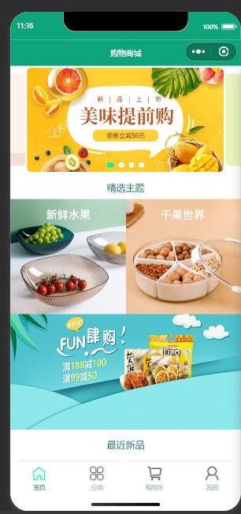
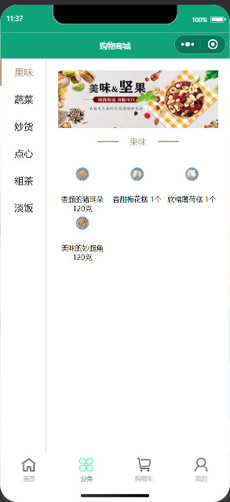
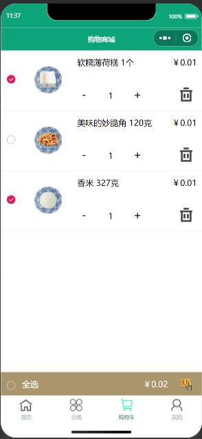
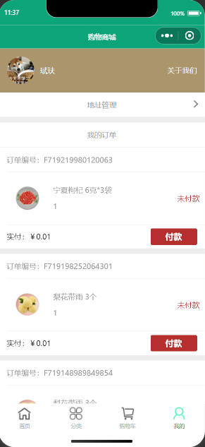

# 零食商城购物微信小程序（V1.0 优化版）

功能完善的零食购物微信小程序演示项目，覆盖 **浏览 → 搜索 → 加购 → 下单 → 支付(Mock) → 配送 → 评价 → 会员/积分/签到** 的完整电商闭环。全站数据由内置 Mock 体系驱动，写操作跨页面真实生效并本地持久化；联调真实后端时只需修改一个布尔开关。

> ⚠️ 演示环境：所有支付/交易均为 Mock，不产生真实交易。

## 一、优化总览（V1.0 已实现）

| # | 优化项 | 状态 |
|---|---|---|
| 1 | 统一 Mock 数据体系重构（`mock/` 16 个数据模块 + 路由分发 + 延迟模拟 + 持久化） | ✅ |
| 2 | 全局数据层 API 收口（`api/http.js` USE_MOCK 开关 + `api/index.js` 业务收口 + 拦截器） | ✅ |
| 3 | 首页体验升级（搜索栏 / 骨架屏 / 分页 / 悬浮购物车角标 / 秒杀预告 / 图片兜底） | ✅ |
| 4 | 分类页交互与筛选体系重构（8 分类导航 / 吸顶排序 / 筛选面板 / 分页） | ✅ |
| 5 | 商品详情页补全（多图/视频轮播 / SKU 弹层 / 评价区 / 收藏 / 看了又看 / 足迹 / 分享） | ✅ |
| 6 | 购物车逻辑修复与体验优化（全选计算修复 / 失效商品区 / 编辑模式 / 优惠明细 / 角标同步） | ✅ |
| 7 | 订单全链路（确认 / 列表 / 详情 timeline / Mock 支付 / 状态推进 / 评价 / 再来一单） | ✅ |
| 8 | 个人中心与会员体系（用户卡 / 订单角标入口 / 会员中心 / 每日签到 / 积分中心） | ✅ |
| 9 | 全局体验规范统一（空态 / 骨架屏 / 图片兜底 / 主题色 #b4282d / 金额格式化 / toast 封装） | ✅ |
| 10 | 搜索与收藏足迹系统（搜索页 / 历史 / 联想 / 收藏记录 / 浏览足迹按日分组） | ✅ |

## 一（二）、V1.1 延伸优化（已实现）

| # | 优化项 | 状态 |
|---|---|---|
| 11 | 优惠券与促销落地（秒杀场次页倒计时+纯CSS抢购进度条+提醒我 / 详情页领券条 / 购物车"还差xx元满减·免配送费"凑单提示 / 自动最优券） | ✅ |
| 12 | 地址与配送体验（标签筛选 / 地图选点+模拟定位 / 配送费实时预览 / 超60km范围拦截 / 今明两日配送时段） | ✅ |
| 13 | 消息通知中心（类型筛选 / 全部已读 / 订单·促销状态变更自动写入 / link 路由表点击直达订单·秒杀·优惠券·拼团页） | ✅ |
| 14 | 客服与售后系统（规则引擎客服会话+常见问题+满意度评价 / 仅退款·退货退款·换货申请 / 工单列表+状态timeline跟踪+模拟商家处理 / 订单售后入口） | ✅ |
| 15 | 拼团与社交裂变（拼团详情页 / 开团·参团→选规格→生成订单→邀请分享 / 24h未成团自动退款 / 分享得积分(5分/次·3次/天) / 邀新得券 / 团购阶梯价批量加购） | ✅ |

V1.1 新增页面：`pages/promotion/seckill`（限时秒杀）、`pages/group/detail`（拼团详情）、`pages/service/chat`（在线客服）、`pages/service/aftersale`（申请售后）、`pages/service/tickets`（售后工单）；新增接口 20+（详见 `API_CONTRACT.md` 第 7/8 节），全部通过 Node 冒烟测试（V1.0 回归 85/85 + V1.1 37/37）。

## 二、技术栈与架构

- 微信小程序**原生开发**（非 Taro/uni-app），style v2，原生导航栏，4 Tab 结构不变
- 主题色 `#b4282d`（价格 / 主按钮 / 选中态 / 角标），页面背景 `#f5f6f7`，卡片白底圆角 `16rpx`，间距 `24rpx`
- 不依赖任何第三方 UI 库：签到日历、成长值进度、秒杀/拼团倒计时、骨架屏均为纯 CSS/WXML
- 数据层：`api/http.js`（统一请求入口，顶部 `const USE_MOCK = true`）→ `mock/index.js`（url+method 路由分发，60+ 接口）→ `mock/data/*`（内存数据库 + `wx.setStorageSync` 持久化）
- 登录态：`app.js onLaunch` 自动注入 Mock 用户并写入 `wx.setStorageSync('userInfo')`，游客无需登录即可体验全部功能
- 事件总线：`app.on/off/emit` + `app.refreshCartBadge()` 实现购物车角标、收藏态、订单状态跨页面同步

## 三、项目结构

```
mini-snacks-shop/
├── app.js                  # 入口：Mock 用户注入 / 事件总线 / 角标同步
├── app.json                # 23 个页面注册；导航栏与 TabBar 统一主题色
├── app.wxss                # 全局设计规范与工具类（卡片/价格/标签/按钮/骨架屏动画等）
├── API_CONTRACT.md         # ★ 数据层契约文档（接口清单 / 响应约定 / 开发规范）
├── api/
│   ├── http.js             # 统一请求入口（USE_MOCK 开关 / 拦截器 / loading / toast / upload）
│   └── index.js            # 业务 API 收口（home/goods/cart/order/member/...）
├── mock/
│   ├── index.js            # Mock 总入口：路由分发 + 内存数据库 + storage 持久化
│   ├── delay.js            # 200~600ms 随机网络延迟
│   ├── _time.js            # 相对时间工具（保证演示数据永远"新鲜"）
│   └── data/               # goods(33条)/categories(8)/carts/addresses/orders(12条全状态)/
│                           # reviews(24)/shopReviews/members/points/checkin/coupons/
│                           # promotions/groups/messages/user/shop/service(客服QA/售后工单/地图POI)
├── components/             # 通用组件
│   ├── goods-card/         # 商品卡（grid/row/mini，内置跳详情+默认规格加购+角标刷新）
│   ├── empty-state/        # 统一空态（插图+文案+操作按钮）
│   ├── skeleton/           # 统一骨架屏（goods/list/order/detail，呼吸动画）
│   └── star-rate/          # 星级评分（展示/打分）
├── utils/
│   ├── format.js           # 金额/日期/销量格式化（formatPrice、safeAdd/safeMul 防浮点误差）
│   ├── format.wxs          # WXML 侧金额过滤器（fmt.formatPrice → ￥xx.xx）
│   ├── toast.js            # showToast/showLoading/confirm 统一封装
│   └── util.js             # 旧工具函数（logs 页使用）
├── static/
│   ├── images/             # default.png（图片兜底）、avatar.png
│   └── mock/               # 38 张本地生成占位图（商品18/banner3/主题3/分类8/店铺3/头像6...）
├── image/                  # TabBar 图标、加购/删除/空态图（沿用）
└── pages/
    ├── index/              # 首页：搜索栏+轮播+主题区+秒杀预告+分页商品流+悬浮购物车
    ├── classic/            # 分类：左侧 8 分类导航 + 右侧吸顶排序/筛选面板 + 分页
    ├── cart/               # 购物车：全选修复/失效区/编辑模式/优惠明细/空态推荐/角标同步
    ├── mine/               # 我的：用户卡+成长值进度+订单角标入口+四组菜单+客服弹层+设置
    ├── search/             # 搜索：历史(15条,单删/清空)+热门+联想(防抖)+结果排序分页
    ├── list/               # 主题商品列表
    ├── detail/             # 详情：图片/视频Tab+previewImage+SKU弹层+评价+收藏+看了又看+足迹+分享
    ├── collect/            # 收藏记录 / 浏览足迹（type 区分，按日期分组）
    ├── order/
    │   ├── confirm         # 订单确认：地址/配送时段/优惠券/备注/支付方式/金额明细
    │   ├── list            # 订单列表：状态Tab(含待评价)+操作按钮+分页
    │   ├── detail          # 订单详情：状态头部+配送timeline+骑手卡+金额明细+模拟配送推进
    │   └── review          # 订单评价：逐商品星级+标签+晒图+店铺三维度，提交赠积分
    ├── address/ newAddress/# 地址列表(含选择模式)/新增编辑（原生 region picker）
    ├── member/
    │   ├── center/         # 会员中心：会员卡+成长值进度+五级体系+特权对照+生日礼包
    │   ├── checkin/        # 每日签到：当月日历+7天奖励梯度+积分动画
    │   └── points/         # 积分中心：明细分页+兑换专区+规则
    ├── coupon/             # 领券中心 / 我的优惠券
    ├── shop/               # 店铺主页 / 店铺评价 / 配送说明
    ├── group/              # 拼团专区(倒计时/开团/批发批量加购) / 我的拼团 + detail 拼团详情(参团/邀请分享)
    ├── promotion/          # seckill 限时秒杀场次页(倒计时+抢购进度条+满减阶梯)
    ├── service/            # chat 在线客服(规则引擎会话) / aftersale 申请售后 / tickets 售后工单跟踪
    ├── message/            # 消息中心（类型筛选/未读红点/全部已读/link 路由跳转）
    ├── logs/ fail/         # 旧日志/失败页（保留）
```

## 四、使用方法

1. 安装[微信开发者工具](https://developers.weixin.qq.com/miniprogram/dev/devtools/download.html)
2. 导入本项目目录，AppID 可选"测试号"
3. 点击"编译"即可体验（无需网络与后端，图片全部本地化）

### Mock / 真实后端切换

```js
// api/http.js 顶部
const USE_MOCK = true;   // 改为 false 即走真实 wx.request（BASE_URL）
```

### 数据契约

所有接口约定见 **`API_CONTRACT.md`**：统一响应 `{ code: 200, data, msg }`，分页 `{ records, total, current, size }`；金额一律为数字（元，两位小数），展示统一 `formatPrice`。

### 演示数据重置

「我的 → 设置 → 清除缓存」或调用 `api.debug.reset()` 可恢复全部 Mock 种子数据。

## 五、关键实现说明

- **购物车全选 bug 修复**：旧版循环中始终累加当前操作项导致金额错误；现金额统一由 mock 层 `summary` 计算（仅 `!invalid && checked` 参与），页面展示接口结果
- **写操作一致性**：加购/下单/领券/签到/兑换/评价/拼团均在内存数据库真实生效并写入 storage，跨页面即时可见（如：评价提交后商品与店铺评价区立刻出现新评价，订单标记已评价，积分 +20）
- **Mock 支付**：点击支付 → 2 秒 loading → 成功回调 → 状态流转；订单详情提供"模拟配送进度"演示入口（待发货→配送中→待收货→已完成，逐步写入 timeline 与消息通知）
- **图片兜底**：全部 `<image>` 绑定 `binderror` 回退 `/static/images/default.png`；商品视频 `binderror` 自动隐藏视频 Tab
- **角标同步**：`app.refreshCartBadge()` 统一维护 TabBar 购物车角标，页面通过 `cartChange` 事件实时刷新悬浮角标

## 六、实现效果（旧版截图，新版以真机为准）

| 首页 | 分类 | 购物车 | 个人中心 |
|---|---|---|---|
|  |  |  |  |

## 许可证

本项目采用 MIT 许可证。
